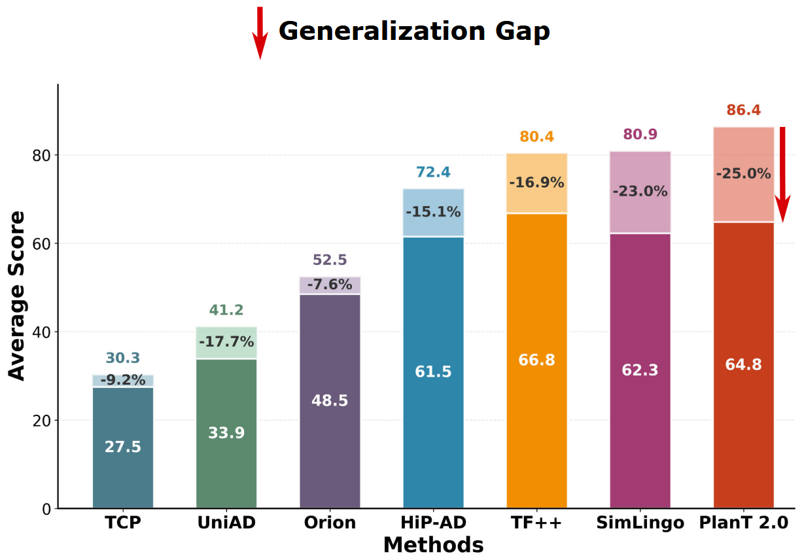
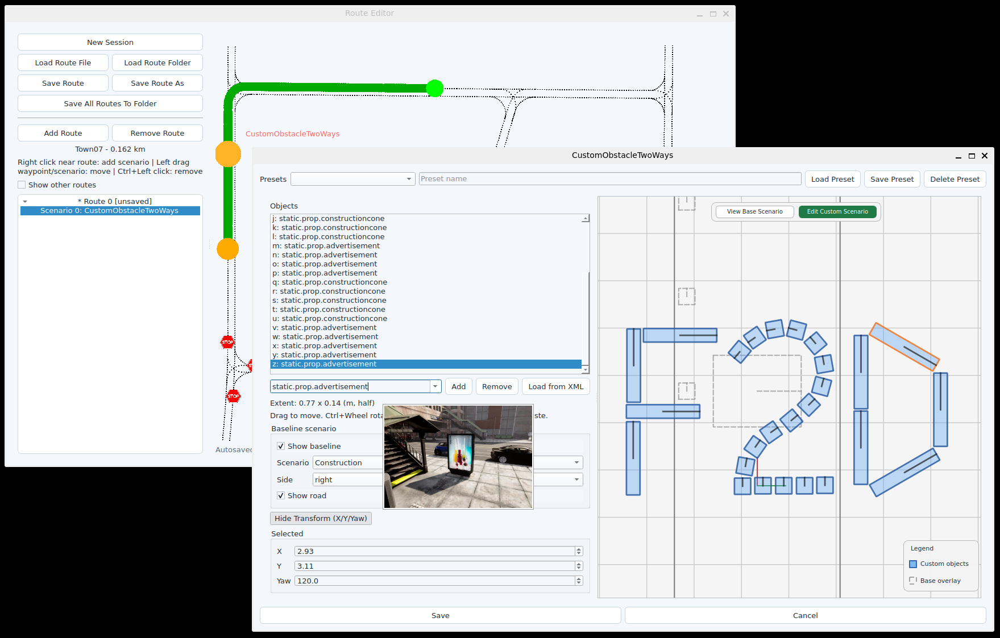

<!--  -->
# Fail2Drive: Benchmarking Closed-Loop Driving Generalization

Fail2Drive is the first CARLA v2 benchmark designed to test closed-loop generalization on truly unseen long-tail scenarios. By pairing each shifted route with an in-distribution reference scenario, it exposes substantial hidden failure modes in current state-of-the-art driving models.

<p align="center">
  <h3 align="center">
    <a href="https://simonger.github.io/fail2drive/">Project Page</a> | 
    <a href="https://arxiv.org/pdf/2604.08535">Paper</a> | 
    <a href="https://huggingface.co/datasets/SimonGer/Fail2Drive">Download</a>
  </h3>
</p>


## Highlights
- 17 unseen scenarios for evaluation of true generalization.
- 30 novel assets including animals, visual noise, and adversarial obstacles.
- Paired route design enables quantification of generalization gap.
- 100 route pairs in diverse environments and configurations.
- Toolbox for creating custom obstacles and routes.
<p align="center">
  <h3 align="center">
    <a href="https://discord.gg/HZ83Em6kyZ">Discord</a> | 
    <a href="https://github.com/SimonGer/fail2drive_scenario_hub">Scenario Hub</a>
  </h3>
</p>


## Leaderboard
<a href="https://github.com/SimonGer/fail2drive_leaderboard"></a> 

## Contents
- [Installation](#installation)
- [Experiments](#experiments)
- [Evaluation](#evaluation)
- [Fail2Drive Toolbox](#fail2drive-toolbox)

## Installation
> If you want to introduce Fail2Drive into an existing CARLA project, we provide a lightweight plugin installation on the [plugin branch](https://github.com/autonomousvision/Fail2Drive/tree/plugin). The installation below includes the `carla_garage` models to provide a starting point for new users.

After a quick installation, you can already explore the benchmark manually, run baseline agents, and start testing custom scenarios.

```bash
# 1. Clone this repository
git clone https://github.com/autonomousvision/fail2drive.git
cd fail2drive

# 2. Set up the Fail2Drive CARLA simulator
mkdir f2d_carla
curl -L \
  https://huggingface.co/datasets/SimonGer/fail2drive/resolve/main/fail2drive_simulator.tar.gz \
  | tar -xz -C f2d_carla

# 3. Create the conda environment
conda env create -f environment.yml
conda activate fail2drive

# NOTE: The pip installed carla==0.9.15 should work, but may cause warnings in some places.
# If you want to install the official Fail2Drive PythonAPI you can find it at:
# f2d_carla/PythonAPI/carla/dist/carla-0.9.15-cp310-cp310-linux_x86_64.whl

# 4. Set environment variables
source env_vars.sh

# Ready to start experimenting!
```

## Experiments
To run any of the experiments below, start CARLA in a second terminal:

```bash
bash ${CARLA_ROOT}/CarlaUE4.sh
```

<details>

<summary>Tips for usage with reduced computational resources</summary>

- Run CARLA with `-RenderOffscreen` to prevent the spectator window from opening.
- Run CARLA with `-quality-level=Low` to reduce rendering cost. Do not use this for final evaluation.
- Run CARLA and the model on different GPUs by specifying `-graphicsadapter=[id]`.

</details>

#### Can you solve the benchmark routes by hand?
```bash
python leaderboard/leaderboard/leaderboard_evaluator.py \
  --agent ${WORK_DIR}/leaderboard/leaderboard/autoagents/human_agent_keyboard.py \
  --routes ${WORK_DIR}/fail2drive_split/Generalization_PedestriansOnRoad_1085.xml
```

#### Running the PDM-Lite expert policy:
```bash
python leaderboard/leaderboard/leaderboard_evaluator_local.py \
  --agent ${WORK_DIR}/team_code/visu_agent.py \
  --track MAP \
  --routes ${WORK_DIR}/fail2drive_split/Generalization_PedestriansOnRoad_1085.xml
```

#### Running the TransFuser++ model:
Before running the model, download the checkpoint into the `checkpoints` folder:

```bash
mkdir -p checkpoints/tfpp
wget -P checkpoints/tfpp \
  https://huggingface.co/SimonGer/TFv5/resolve/main/all_towns/model_0030_0.pth \
  https://huggingface.co/SimonGer/TFv5/resolve/main/all_towns/config.json
```

Then run TransFuser++ with the `LIVE_VISU` flag to inspect the model inputs live:

```bash
LIVE_VISU=1 python leaderboard/leaderboard/leaderboard_evaluator_local.py \
  --routes ${WORK_DIR}/fail2drive_split/Generalization_PedestriansOnRoad_1085.xml \
  --agent ${WORK_DIR}/team_code/sensor_agent.py \
  --agent-config ${WORK_DIR}/checkpoints/tfpp
```

## Evaluation

### Fail2Drive Rules
As an offline benchmark, users have access to the full evaluation routes and assets. To prevent overfitting and keep Fail2Drive fair, we establish the following rules:

1. **No training on Fail2Drive scenarios.** Models must not use the routes, scenario definitions, or assets introduced in Fail2Drive for training or fine-tuning. The benchmark serves strictly as a held-out test set.

2. **External pretraining is allowed.** Pretraining on large-scale real-world datasets, internet-scale multimodal corpora, foundation models, or VLM/LLM backbones is permitted. Such general visual or linguistic knowledge is considered part of the model prior and not a violation of the benchmark.

3. **Leaderboard entry.** We encourage users to submit final scores through the public evaluation repository via pull request in the [offical Leaderboard repository](https://github.com/SimonGer/fail2drive_leaderboard). This enables consistent comparison and facilitates transparent benchmarking.

### SLURM evaluation
We provide tools to evaluate models on the full benchmark using a SLURM cluster. The [slurm_evaluate.py](slurm_evaluate.py) script automatically submits jobs up to a limit specified by [eval_num_jobs.txt](eval_num_jobs.txt) and monitors the evaluation. Small modifications are necessary to adapt this script to your specific cluster and model. Look for `NOTE` and `TODO` comments in the script.

If you run into problems during evaluations, feel free to open an issue!

### Result generation
To obtain the final scores, use the [tools/f2d_result_parser.py](tools/f2d_result_parser.py) script.

```bash
python tools/f2d_result_parser.py /path/to/results --method MyMethod
```


## Fail2Drive Toolbox
We provide tools to generate new routes using the customizable scenarios and novel assets provided by Fail2Drive.



You can find the documentation for these tools [here](toolbox).

To share and browse community-created scenarios, visit our scenario hub [here](https://github.com/SimonGer/fail2drive_scenario_hub).
